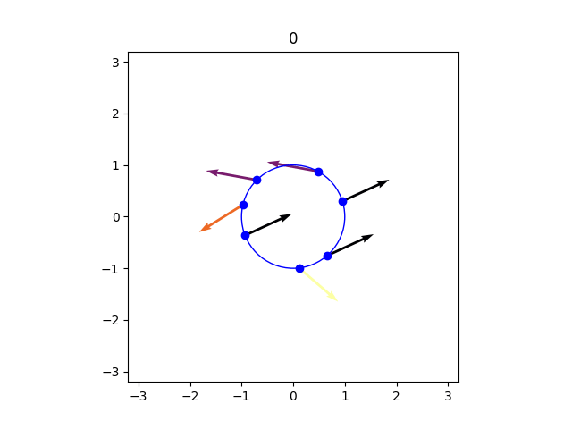
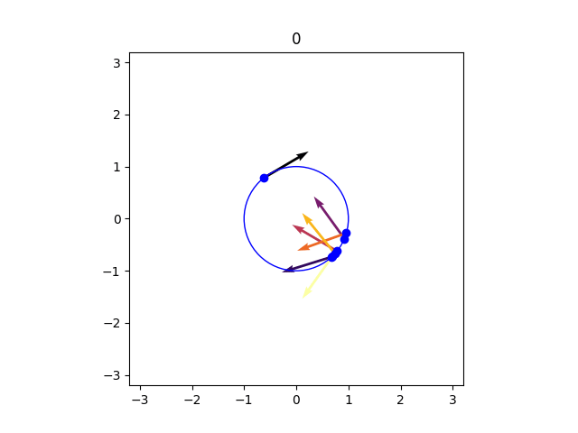
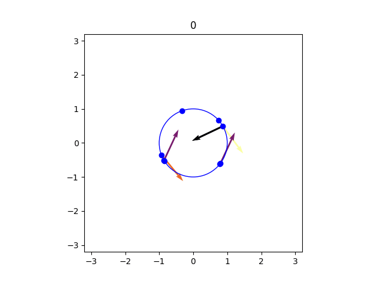
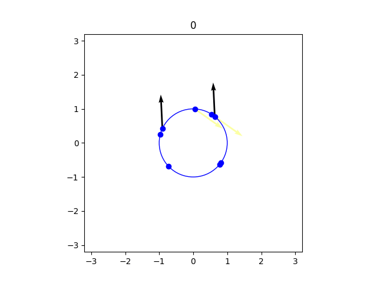
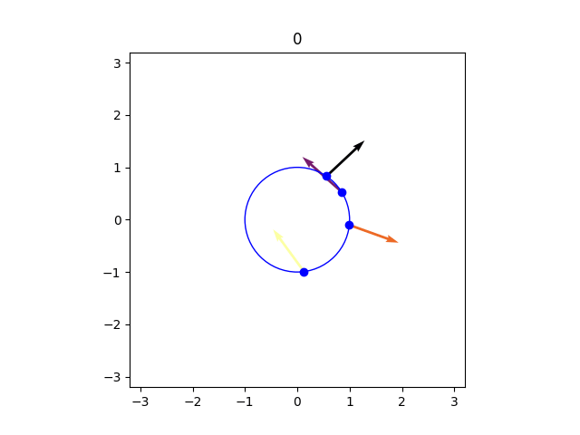
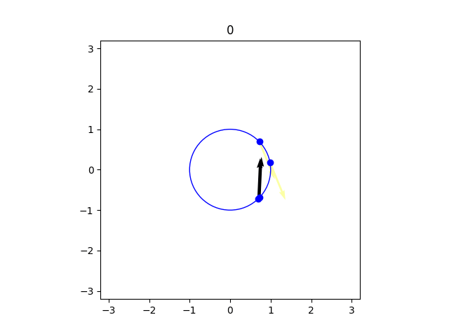
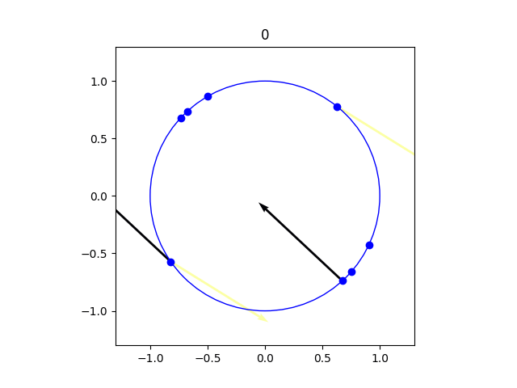
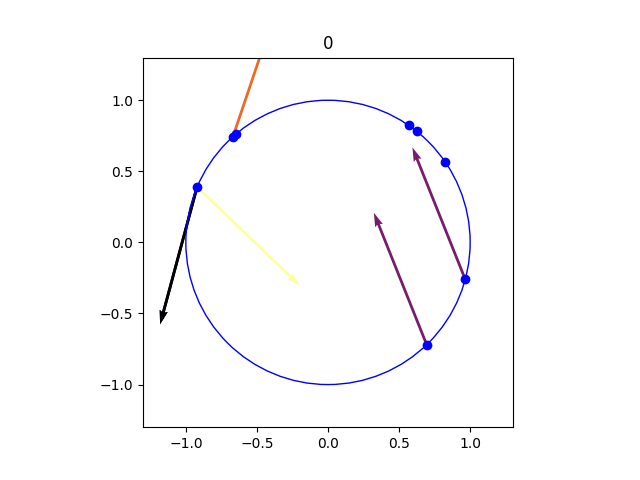
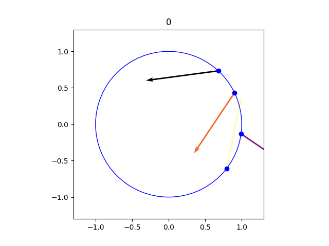
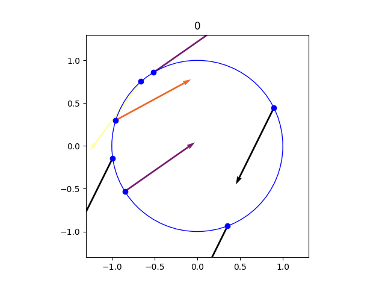

# KG_21
A 2d visualization of the **TransE** algorithm from [*Translating Embeddings for Modeling Multi-relational Data* by Bordes et al. (2013)](https://proceedings.neurips.cc/paper/2013/file/1cecc7a77928ca8133fa24680a88d2f9-Paper.pdf).

## 2D Visualizations
 
 
 

## Same graphs different dimensions

Click on an image to enlarge it.

2D | 3D | 4D (computed vectors are 4 dimensional,  3 dimensions are plotted)
--- | --- | ---
 |  | 
 |  | 
 |  | 
 |  | 

## Built with
- Python 3.8
- NumPy 1.20.1  
- Matplotlib 3.3.4   
- FFmpeg 1.4
